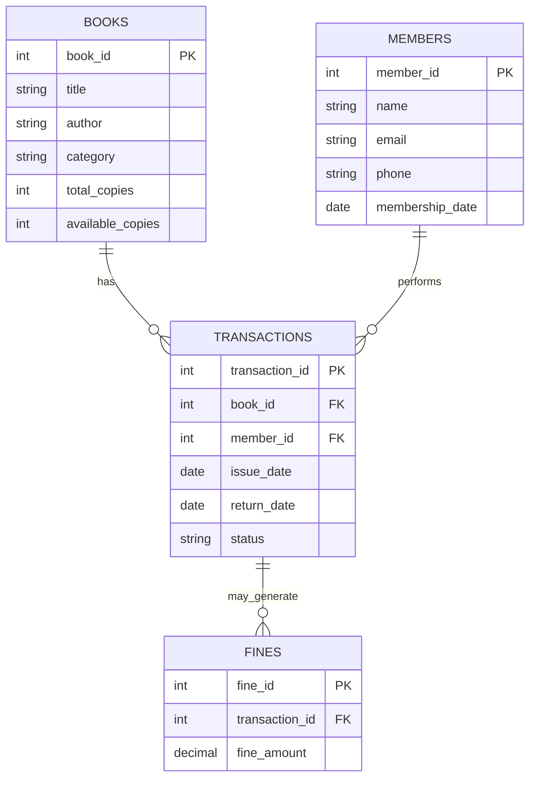

# 📚 Library Management System – Java & MySQL (JDBC)

A console-based backend system developed using **Java** and **MySQL (JDBC)** to automate and streamline modern library operations. The system manages **books, members, issues, returns, and fine calculation** using a structured relational database.

---

## 🌟 Overview

This project digitalizes the workflow of a library by replacing manual registers with an efficient **database-driven system**.

It ensures:

* Accurate book tracking
* Smooth member management
* Reliable transaction recording
* Automatic fine generation

The system demonstrates strong backend development skills and real-world DBMS implementation using well-designed tables and JDBC logic.

---

# 🗄️ Database Structure (MySQL Tables)

The system uses **four interconnected relational tables** for clean and organized data flow.

---

## 📘 **Books Table**

Stores details of all books available in the library.

* **book_id**
* **title**
* **author**
* **category**
* **total_copies**
* **available_copies**

## 👤 **Members Table**

Holds information about individuals who borrow books.

* **member_id**
* **name**
* **email**
* **phone**
* **membership_date**

## 🔄 **Transactions Table**

Tracks every issued and returned book with full history.

* **transaction_id**
* **book_id**
* **member_id**
* **issue_date**
* **return_date**
* **status**

## 💰 **Fines Table**

Stores fine amounts generated for late returns.

* **fine_id**
* **transaction_id**
* **fine_amount**

---

# 🔑 Key Functional Modules

## 📘 **1. Book Management**

* Add new books
* Update existing book details
* Maintain availability count
* Search books by title

Ensures a structured and searchable catalogue.

## 👤 **2. Member Management**

* Register new members
* Store identity and contact information
* Maintain membership history

Enables smooth tracking of borrowers and their activities.

## 🔄 **3. Book Issue & Return Management**

### **Issuing a Book**

* Validates book availability
* Records issue details in the **Transactions** table
* Reduces **available_copies** automatically

### **Returning a Book**

* Records the return date
* Updates transaction status
* Restores book availability
* Triggers fine calculation

This module mirrors real-life library operations.

# 💰 Automated Fine Calculation

When a book is returned, the system compares the **issue_date** and **return_date**.

If the return exceeds **15 days**, a fine is calculated based on extra days.

The calculated fine is inserted into the **Fines** table using the `transaction_id`.

This ensures consistent, automatic, and tamper-proof fine handling.

---

# 🧩 Practical Value & Real-World Relevance

This system is designed with real library workflows in mind.

* **End-to-end operational coverage**
* **Database-backed reliability**
* **Realistic backend logic**
* **Scalable foundation**

It reflects real-world software quality by using normalized tables, clean relationships, and automated operations.

---

# 🖼️ ER Diagram

---

# 🏁 Conclusion

The **Library Management System** integrates **Java**, **JDBC**, and **MySQL** to build a reliable and functional backend application. It showcases key principles of:

* Software design
* Database management
* Logical problem solving

---

